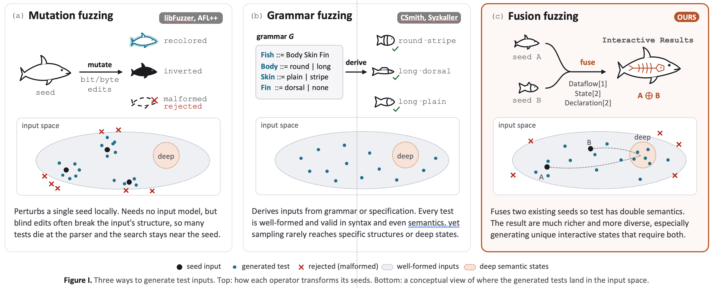

# Fusion Fuzz


Fusion-fuzz is a scalable and effective fuzzer to discover bugs in various compilers and interpreters.

The core idea of fusion-fuzz is **program fusion**, which bridges the behavior of two (or more) independent seed programs so the fused program exercises interactions neither seed triggers alone.



Program fusion now has three fusion strategies: **dataflow fusion**, **state fusion**, and **declaration fusion**.

- **Dataflow fusion** - connect dataflow from parent seeds by interleaving variables.

Example of dataflow fusion:

```php
/* seed A */
$dom = new DOMDocument;
$dom->loadXML(..);
$ref = $dom->documentElement->firstChild;
$nodes = $ref->childNodes;

$fusion = $nodes; // dataflow bridge 

/* seed B */
$values = array(..);
foreach ($fusion as $str) //foreach ($values as $str)
    { $enc = base64_encode($str); }

/* output */
// AddressSanitizer: heap-use-after-free ..
```

- **State fusion** — bridge behaviors at the *interesting program points - the point holding more live variables* via interleaving program statements.

```php
<?php
function dump($dom, $name) {
$list = $dom->getElementsByTagName($name)[0]
->getInScopeNamespaces();
foreach ($list as $entry) {
	/* self state fusion */ /* more live variables */
	$dom = Dom\XMLDocument::createFromString(<<<XML
	<root xmlns="urn:a">
	<child xmlns="">
	<c:child xmlns:c="urn:c"/> </child>
	<b:sibling xmlns:b="urn:b" xmlns:d="urn:d" d:foo="bar">
	</b:sibling>
	</root>
	XML);
	dump($dom, 'c:child');
	dump($dom, 'child');
}
}
$dom = Dom\XMLDocument::createFromString(<<<XML
<root xmlns="urn:a">
<child xmlns="">
<c:child xmlns:c="urn:c"/> </child>
<b:sibling xmlns:b="urn:b" xmlns:d="urn:d" d:foo="bar">
<d:child xmlns:d="urn:d2"/>
</b:sibling>
</root>
XML);
dump($dom, 'c:child');
dump($dom, 'child');
// SUMMARY: AddressSanitizer: double-free
```

- **Declaration fusion** — enforce *declaration dependencies* instead of variables or statements. 

Example of declaration fusion:

```swift
// seed A
class C: P {}
// seed B  
class Generic<T> : Concrete {
  typealias GenericAlias = (T, T)
}
protocol BaseProto: C {} // declaration dependency from A to B
protocol ProtoRefinesClass where Self : Generic<Int>, Self : BaseProto {
  func requirementUsesClassTypes(_: ConcreteAlias, _: GenericAlias)
}
```

The scalability of fusion-fuzz is mostly from **seed migration**, which translates seed programs from one target into every other target. 

Supported projects fall into two families. The adapters share the same
core (seed migration, the three fusion strategies, the bug oracle and the
reducer); what differs per project is how a seed is parsed, how the target is
built (from source, with assertions and sanitizers on wherever the build
allows) and how a run is judged.

### Machine learning and accelerator language processors

Compilers whose input is a tensor program or a GPU kernel: HLO, TVMScript,
Triton IR, CUDA C++, Mojo, MLIR dialects and shading languages. They run
without a GPU — the adapters compile to PTX, cubin, object code or IR, and
XLA and TVM also execute on the CPU backend for differential checks.

| Project | Input | Status | Dataflow fusion | State fusion | Declaration fusion |
|---------|-------|--------|:---:|:---:|:---:|
|  | HLO text (CPU backend, compile-only GPU backend) | **Supported** | ✅ | ✅ | ✅ |
|  | TVMScript modules (TIR and Relax) | **Experimental** | ✅ | ✅ | ✅ |
|  | Triton IR / TritonGPU IR (`triton-opt`) | **Experimental** | ✅ | ✅ | ✅ |
|  | CUDA C++ (clang CUDA frontend and nvcc) | **Experimental** | ✅ | ✅ | ✅ |
|  | Mojo (compiler built from source) | **Experimental** | ✅ | ✅ | ✅ |
|  | MLIR dialects (`mlir-opt`) | **Supported** | ✅ | ✅ | ✅ |
|  | WGSL (shader compiler) | **Experimental** | ✅ | ✅ | ✅ |
|  | WGSL (shader compiler) | **Experimental** | ✅ | ✅ | ✅ |

### General-purpose language processors

Compilers and interpreters of general-purpose programming languages, from
the C family and Fortran to scripting-language runtimes and JavaScript
engines.

| Project | Input | Status | Dataflow fusion | State fusion | Declaration fusion |
|---------|-------|--------|:---:|:---:|:---:|
|  | PHP | **Supported** | ✅ | ✅ | ✅ |
|  | Python | **Supported** | ✅ | ✅ | ✅ |
|  | Swift | **Supported** | ✅ | ✅ | ✅ |
|  | C, C++, Objective-C | **Supported** | ✅ | ✅ | ✅ |
|  | Fortran | **Supported** | ✅ | ✅ | ✅ |
|  | Fortran | **Supported** | ✅ | ✅ | ✅ |
|  | Haskell | **Supported** | ✅ | ✅ | ✅ |
|  | Rust | **Experimental** | ✅ | ✅ | ✅ |
|  | C, C++ | **Experimental** | ✅ | ✅ | ✅ |
|  | Go | **Experimental** | ✅ | ✅ | ✅ |
|  | JavaScript | **Experimental** | ✅ | ✅ | ✅ |
|  | JavaScript | **Experimental** | ✅ | ✅ | ✅ |
|  | TypeScript | **Experimental** | ✅ | ✅ | ✅ |
|  | Ruby | **Experimental** | ✅ | ✅ | ✅ |
|  | R | **Experimental** | ✅ | ✅ | ✅ |
|  | Julia | **Experimental** | ✅ | ✅ | ✅ |

**Supported** means the adapter has been run at length, its valid-fusion rate
measured, and real bugs reported from it. **Experimental** means all three
fusion strategies are wired and the adapter runs end to end, but it has had far
less fuzzing time, so its valid-fusion rate and its oracle's false-positive
behaviour are not yet well characterised.

**Bugs found by Fusion Fuzz are tracked at https://fusion-fuzz.github.io (updated periodically).**

Try fusion-fuzz: 

(fusion-fuzz is tested in ubuntu 22.04 and ubuntu 24.04)

(i) before cloning fusion-fuzz, please install *git-lfs*, which is necessary to download our translated corpus (hundreds of MBs).

(ii) install *docker.io*. fusion-fuzz only runs in the docker to keep the host clean.

(iii) for every supported project, go to the project folder. Take PHP as example: `cd ./projects/php` and build the docker `docker build -t fusion-fuzz-php .`

(iv) start the docker `docker run --name fuzz-php -dit -v <your fusion-fuzz path>:/home/fuzz/WorkSpace/fusion-fuzz fusion-fuzz-php:latest` and go to the docker bash `docker exec -it fuzz-php bash`

(v) in the docker bash, you might want to grant 777 permissions for the fuzzing folder first. fusion-fuzz docker user:pass is `fuzz:fuzz`. You can try `sudo chmod -R 777 /home/fuzz/WorkSpace/fusion-fuzz`

(vi) create a tmux bash and start the fuzzer in the docker. `python3 main.py --project php --setup --pre-analysis --dataflow-fusion --state-fusion --declaration-fusion`


You should be able to see bugs found by fusion-fuzz in ./output/bugs/<project-name>.
